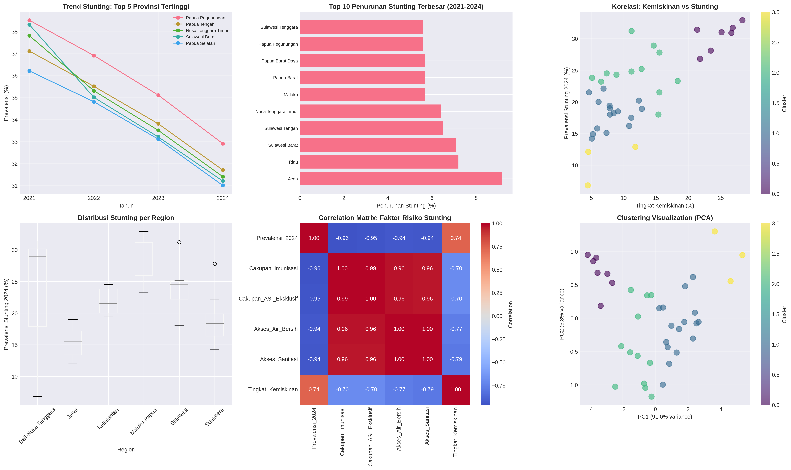

# Analisis Pattern Stunting Indonesia: Pendekatan Data Mining

> Mengungkap pola dan faktor kunci penurunan stunting di 38 provinsi Indonesia melalui analisis data SSGI 2021-2024



---

## Latar Belakang

Stunting tetap menjadi tantangan kesehatan publik di Indonesia dengan prevalensi 21.9% pada 2024. Project ini menggunakan pendekatan data mining untuk menganalisis data dari 38 provinsi selama 4 tahun, mengidentifikasi pattern sukses, dan memberikan rekomendasi berbasis bukti untuk akselerasi penurunan stunting.

**Pertanyaan Riset:**
- Provinsi mana yang berhasil menurunkan stunting paling signifikan?
- Apa faktor paling berpengaruh terhadap penurunan stunting?
- Bagaimana karakteristik provinsi dengan stunting rendah vs tinggi?
- Daerah mana yang butuh prioritas intervensi tertinggi?

---

## Dataset

**Sumber**: Simulasi berdasarkan Survei Status Gizi Indonesia (SSGI) - Kementerian Kesehatan RI

**Cakupan**: 
- 38 Provinsi Indonesia
- Periode: 2021-2024
- 13 Variabel (prevalensi stunting, cakupan imunisasi, ASI eksklusif, akses sanitasi, air bersih, tingkat kemiskinan, dll)

**File**: `data_stunting_provinsi.csv`

---

## Metodologi

### 1. Exploratory Data Analysis
Analisis trend temporal dan perbandingan regional untuk memahami pola penurunan stunting.

### 2. K-Means Clustering
Pengelompokan 38 provinsi menjadi 4 cluster berdasarkan 6 fitur kesehatan dan ekonomi menggunakan StandardScaler untuk normalisasi.

### 3. Correlation Analysis
Identifikasi faktor dengan korelasi terkuat terhadap prevalensi stunting menggunakan Pearson correlation.

### 4. Association Rules Mining
Pattern discovery untuk menemukan kombinasi faktor yang sering muncul bersama stunting tinggi/rendah.

### 5. Predictive & Priority Scoring
Prediksi stunting 2025 dan scoring prioritas intervensi berdasarkan weighted composite index.

---

## Key Findings

### Tren Nasional
Prevalensi stunting turun dari **26.1%** (2021) menjadi **21.9%** (2024), penurunan rata-rata 1.4 poin per tahun.

### Clustering Results

**Cluster 1 - High Risk (30.4%)**  
Papua dan sekitarnya. Cakupan imunisasi rendah (62%), sanitasi buruk (71%), kemiskinan tinggi (24.8%).

**Cluster 2 - Moderate-Low (18.1%)**  
16 provinsi di Sumatera, Jawa, Kalimantan. Performance seimbang di semua indikator.

**Cluster 3 - Moderate-High (24.7%)**  
12 provinsi dengan mixed performance, butuh targeted intervention.

**Cluster 4 - Excellent (10.6%)**  
DKI Jakarta, Yogyakarta, Bali. Semua indikator di atas rata-rata nasional.

### Faktor Paling Berpengaruh

| Faktor | Korelasi | Interpretasi |
|--------|----------|--------------|
| Cakupan Imunisasi | -0.96 | Sangat protektif |
| Cakupan ASI Eksklusif | -0.95 | Sangat protektif |
| Akses Sanitasi | -0.94 | Sangat protektif |
| Tingkat Kemiskinan | +0.74 | Faktor risiko tinggi |

**Insight Utama**: Peningkatan cakupan imunisasi 10% dapat menurunkan prevalensi stunting hingga ~10%.

### Pattern yang Ditemukan

**Pattern 1**: Stunting Tinggi + Kemiskinan Tinggi  
13 provinsi teridentifikasi dengan pattern ini, mengindikasikan pentingnya intervensi ekonomi bersamaan dengan program kesehatan.

**Pattern 2**: Stunting Rendah + Imunisasi Tinggi + Sanitasi Baik  
4 provinsi (DKI, Yogyakarta, Banten, Bali) menunjukkan pattern sukses yang bisa direplikasi.

### Top Performers
**Penurunan Terbesar:**
- Riau: 32.3% (dari 22.3% ke 15.1%)
- Aceh: 24.9% (dari 37.0% ke 27.8%)
- Sulawesi Barat: 18.5% (dari 38.3% ke 31.2%)

### Prioritas Intervensi

**TOP 3 Provinsi Prioritas Tinggi:**
1. Papua Pegunungan (Priority Score: 32.77)
2. Papua Tengah (Priority Score: 31.71)
3. Papua (Priority Score: 31.17)

---

## Rekomendasi Kebijakan

### Quick Wins
1. **Scale-up Program Imunisasi** di 10 provinsi dengan cakupan <65%
   - Target: 85% coverage nasional
   - Impact potensial: Penurunan ~8-10% stunting

2. **Kampanye ASI Eksklusif**
   - Fokus pada edukasi ibu hamil dan menyusui
   - Dukungan lactation counselor di puskesmas

3. **Percepatan Sanitasi**
   - Jambanisasi massal di daerah prioritas
   - Target: 90% akses sanitasi layak

### Strategi Berbasis Cluster
- **Cluster High Risk**: All-in intervention (imunisasi + sanitasi + ASI + ekonomi)
- **Cluster Moderate**: Targeted intervention pada gap terbesar
- **Cluster Excellent**: Disseminasi best practices ke provinsi lain

### Target 2025
Dengan tren saat ini, prediksi prevalensi 2025 adalah 20.4%. Untuk mencapai target pemerintah 18.8%, diperlukan akselerasi **1.6 poin persentase** melalui intensifikasi program di 10 provinsi prioritas.

---

## Instalasi dan Penggunaan

### Requirements
```bash
pip install pandas numpy matplotlib seaborn scikit-learn scipy
```

### Menjalankan Analisis
```bash
python analisis_stunting.py
```

### Output
- `analisis_stunting_visualization.png` - 6 grafik komprehensif
- `data_stunting_enriched.csv` - Dataset dengan hasil clustering dan prediksi
- Console output dengan analisis lengkap

---

## Struktur Repository

```
├── analisis_stunting.py              # Script utama analisis
├── data_stunting_provinsi.csv        # Dataset input
├── data_stunting_enriched.csv        # Dataset hasil analisis
├── analisis_stunting_visualization.png  # Visualisasi hasil
├── DOKUMENTASI_PROJECT.md            # Dokumentasi teknis lengkap
└── README.md                         # File ini
```

---

## Visualisasi

Project menghasilkan 6 visualisasi komprehensif:

1. **Trend Line Chart** - Pergerakan stunting 5 provinsi tertinggi (2021-2024)
2. **Bar Chart** - Top 10 provinsi dengan penurunan terbesar
3. **Scatter Plot** - Korelasi kemiskinan vs stunting dengan clustering
4. **Box Plot** - Distribusi stunting per region geografis
5. **Correlation Heatmap** - Matriks korelasi antar faktor risiko
6. **PCA Visualization** - Hasil clustering dalam 2D space

---

## Teknologi

- **Python 3.12** - Bahasa pemrograman
- **Pandas & NumPy** - Data manipulation
- **Scikit-learn** - Machine learning (K-Means, PCA, StandardScaler)
- **Matplotlib & Seaborn** - Visualisasi data
- **SciPy** - Statistical analysis

---

## Pengembangan Lanjutan

Beberapa ide untuk ekspansi project:

- **Time Series Forecasting**: ARIMA untuk prediksi lebih akurat dengan confidence intervals
- **Classification Models**: Random Forest/XGBoost untuk predict provinsi yang gagal capai target
- **Geospatial Analysis**: Mapping dan spatial clustering menggunakan GeoPandas
- **Dashboard Interaktif**: Implementasi dengan Streamlit atau Plotly Dash
- **Deep Learning**: Neural network untuk prediksi multi-variabel

---

## Referensi & Data Source

### Data Riil
Project ini menggunakan data simulasi berdasarkan pattern dari:
- Survei Status Gizi Indonesia (SSGI) 2022, 2023, 2024 - Kementerian Kesehatan RI
- Portal Layanan Data Kemenkes: https://layanandata.kemkes.go.id/
- Tim Percepatan Penurunan Stunting: https://stunting.go.id/
- BPS - Indeks Khusus Penanganan Stunting

### Literatur
- Kemenkes RI. (2024). Buku SSGI 2024 Dalam Angka
- WHO. (2023). Global Nutrition Report
- TNP2K. (2022). Strategi Nasional Percepatan Pencegahan Stunting

---

## Kontribusi

Project ini terbuka untuk kontribusi. Beberapa area yang bisa dikembangkan:
- Penambahan data kabupaten/kota untuk analisis lebih granular
- Implementasi algoritma clustering lain (DBSCAN, Hierarchical)
- Feature engineering untuk predictive model lebih akurat
- Dashboard web untuk visualisasi interaktif

---

## Lisensi

MIT License - silakan gunakan untuk keperluan akademik dan penelitian.

---

## Disclaimer

Dataset yang digunakan adalah simulasi berdasarkan pattern data riil untuk tujuan educational dan demonstrasi teknik data mining. Untuk penelitian formal atau publikasi, gunakan data resmi dari Kementerian Kesehatan RI.

---

## Kontak & Informasi

kailahidayatussakinah@gmail.com

Project ini dikembangkan sebagai demonstrasi aplikasi data mining dalam bidang kesehatan publik. 

**Untuk data resmi**: Hubungi Kementerian Kesehatan RI melalui layanandata.kemkes.go.id

---

*Last updated: November 2025*
